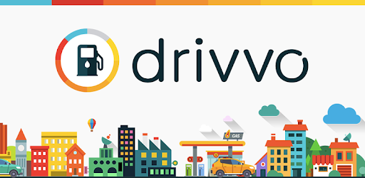
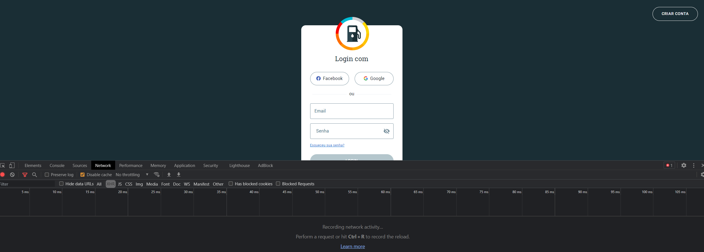
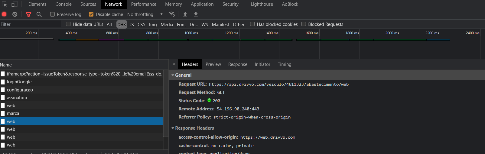
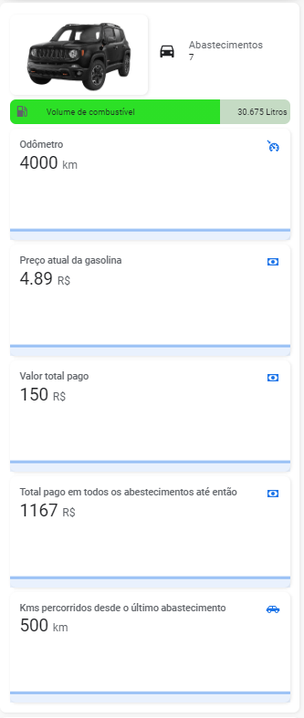

 [![BuyMeCoffee][buymecoffeebedge]][buymecoffee]

# Drivvo Sensor Component



Componente customizado para obter informações presentes no [drivvo.com](https://www.drivvo.com/pt) para o home assistant.

# Instalação

## HACS

- Tenha o [HACS](https://hacs.xyz/) instalado, isso permitirá que você atualize facilmente.
- Adicione https://github.com/hudsonbrendon/sensor.drivvo como um repositório personalizado do Tipo: Integração
- Clique em Instalar na integração "Drivvo".
- Reinicie Home-Assistant.

## Manual

- Copie o diretório custom_components/drivvo para o seu diretório <config dir>/custom_components.
- Configure.
- Reinicie o Home-Assistant.

# Configuração

```yaml
- platform: drivvo
  email: your-email
  password: your-passowrd
  model: model-vehicle ## Informe o nome do modelo do carro, por exemplo: Jeep Renegade
  id_vehicle: id-vehicle
```

## Obtendo o id_vehicle

Acesse a página de [login](https://web.drivvo.com/auth/login), abra o console do navegador com o atalho *(CTRL + SHIFT + J)*, selecione a aba **Rede** e selecione a opção **XHR** como mostrado na imagem abaixo:



Efetue o login com seu usuário, no console aparecerá uma lista de requisições feitas, pesquise pelas que tem o prefixo **web** como mostrado na imagem abaixo:



Selecione uma requisição e na aba **Headers** dessa requisição, aparecerá a url acessada, que seguirá esse padrão: https://api.drivvo.com/veiculo/12345/abastecimento/web

O id do seu veículo será o número que estará no lugar do 12345, utilize ele na sua configuração do drivvo, informando ele no parâmetro **id_vehicle**.

# Construindo um card

Para visualizar as informações dos drivvo, segue um exemplo de um card. Lembre-se de substituir as entidades presentes no card pelas suas entidades.


```yaml
type: custom:config-template-card
entities:
  - sensor.jeep_renegade_abastecimento # Substitua pelo seu sensor
card:
  type: entities
  show_header_toggle: 'off'
  style: |
    .card-header {
      padding: 0px 0px 0px 0px !important;
    }
  entities:
    - type: custom:hui-vertical-stack-card
      cards:
        - type: horizontal-stack
          cards:
            - type: picture
              style: |
                ha-card {
                    --paper-card-background-color: 'rgba(0, 0, 0, 0.0)';
                    --ha-card-background: "rgba(0, 0, 0, 0.0)";
                    --ha-card-box-shadow: 'none';
                }
              image: /local/images/jeep.png # Substitua pela imagem do seu veículo
            - type: custom:button-card
              layout: icon_name_state2nd
              show_icon: true
              show_state: true
              styles:
                grid:
                  - grid-template-columns: 50px auto
                icon:
                  - padding: 0px 0px
                  - height: 100px
                  - width: 30px
                card:
                  - '--ha-card-background': rgba(0, 0, 0, 0.0)
                  - '--ha-card-box-shadow': none
                state:
                  - padding: 0px 10px
                  - justify-self: start
                  - font-family: Roboto, sans-serif
                  - font-size: 15px
                name:
                  - padding: 0px 10px
                  - justify-self: start
                  - color: var(--secondary-text-color)
              entity: sensor.jeep_renegade_abastecimento # Substitua pelo seu sensor
              name: Abastecimentos
              icon: mdi:car
        - type: custom:bar-card
          show_icon: true
          align: split
          columns: 1
          max: 41
          positions:
            icon: inside
            indicator: inside
            name: inside
            value: inside
          unit_of_measurement: Litros
          animation: 'on'
          severity:
            - color: '#fd0000'
              from: 1
              to: 19
            - color: '#ffaa00'
              from: 20
              to: 29
            - color: '#2CE026'
              from: 30
              to: 41
          style: |
            ha-card {
                --paper-card-background-color: 'rgba(0, 0, 0, 0.0)';
                --ha-card-background: "rgba(0, 0, 0, 0.0)";
                --paper-item-icon-color: 'var(--text-primary-color';
                --ha-card-box-shadow: 'none';
            }
          entities:
            - entity: sensor.jeep_renegade_abastecimento # Substitua pelo seu sensor
              attribute: volume_de_combustivel
          name: Volume de combustível
          entity_row: true
        - type: sensor
          entity: sensor.jeep_renegade_abastecimento # Substitua pelo seu sensor
          attribute: odometro
          graph: line
          detail: 2
          name: Odômetro
          icon: mdi:car-cruise-control
          unit: km
        - type: sensor
          entity: sensor.jeep_renegade_abastecimento # Substitua pelo seu sensor
          attribute: preco_do_combustivel
          graph: line
          detail: 2
          name: Preço atual da gasolina
          icon: mdi:cash
          unit: R$
        - type: sensor
          entity: sensor.jeep_renegade_abastecimento # Substitua pelo seu sensor
          attribute: valor_total_pago
          graph: line
          detail: 2
          name: Valor total pago
          icon: mdi:cash
          unit: R$
        - type: sensor
          entity: sensor.jeep_renegade_abastecimento # Substitua pelo seu sensor
          attribute: soma_total_de_valores_pagos_em_todos_os_abastecimentos
          graph: line
          detail: 2
          name: Total pago em todos os abestecimentos até então
          icon: mdi:cash
          unit: R$
        - type: sensor
          entity: sensor.jeep_renegade_abastecimento # Substitua pelo seu sensor
          attribute: km_percorridos_desde_o_ultimo_abastecimento
          graph: line
          detail: 2
          name: Kms percorridos desde o último abastecimento
          icon: mdi:car-hatchback
          unit: km
```

Após a configuração, o card acima ficará com essa aparência:



# Debugando

```yaml
logger:
  default: info
  logs:
    custom_components.drivvo: debug
```

[buymecoffee]: https://www.buymeacoffee.com/hudsonbrendon
[buymecoffeebedge]: https://camo.githubusercontent.com/cd005dca0ef55d7725912ec03a936d3a7c8de5b5/68747470733a2f2f696d672e736869656c64732e696f2f62616467652f6275792532306d6525323061253230636f666665652d646f6e6174652d79656c6c6f772e737667